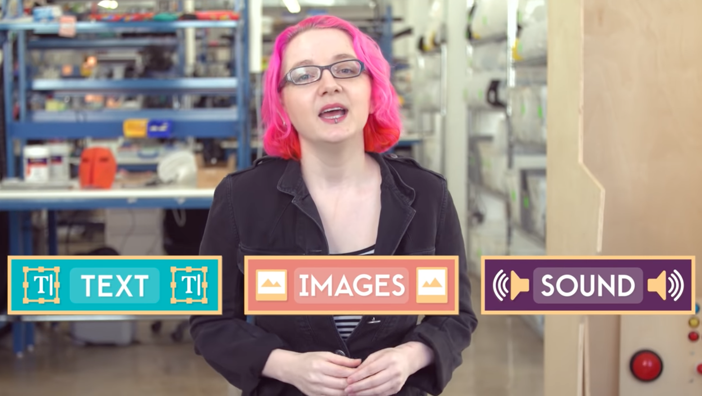
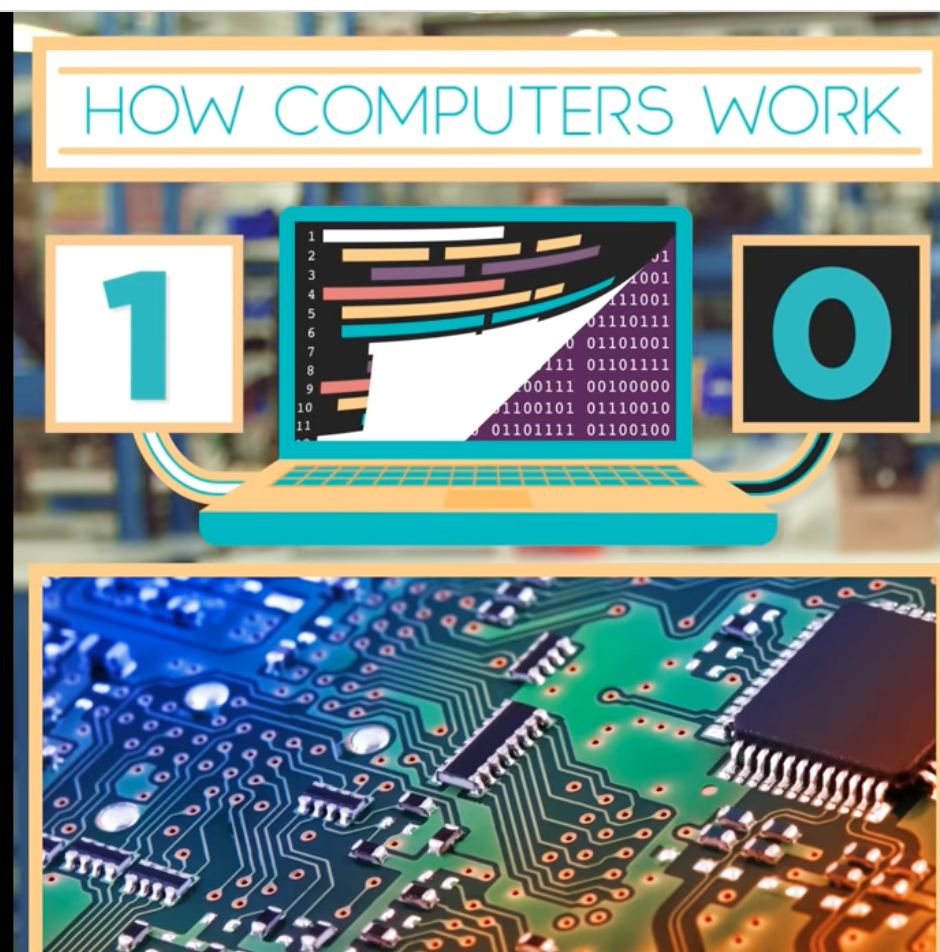
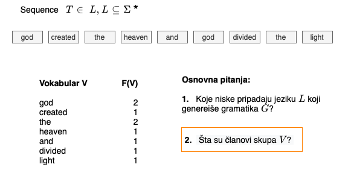
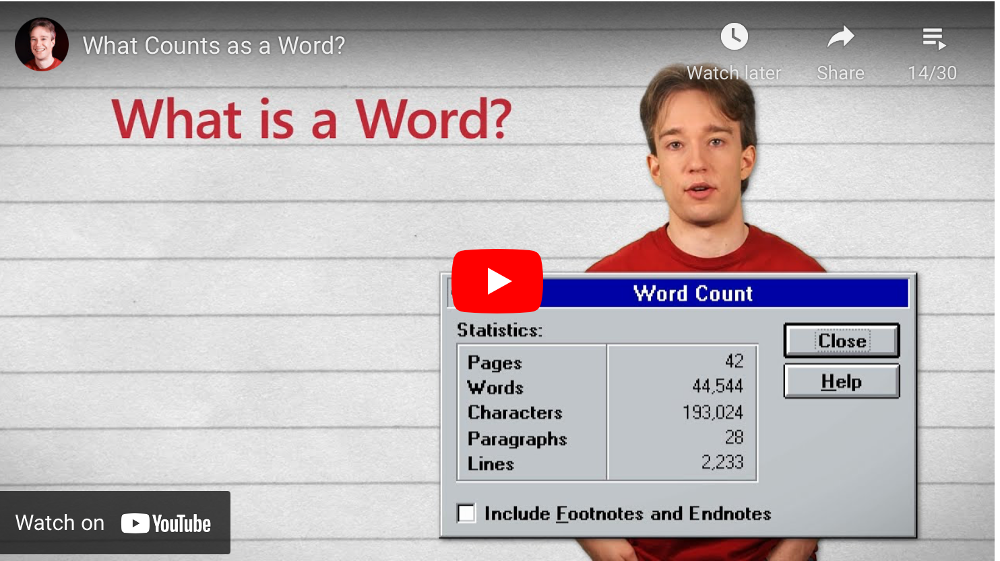
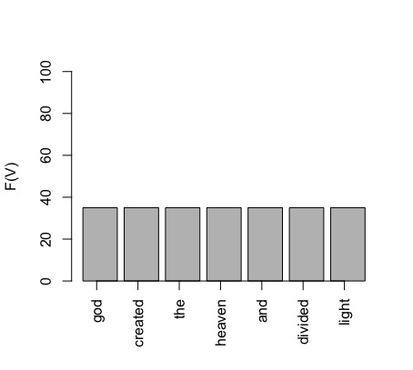
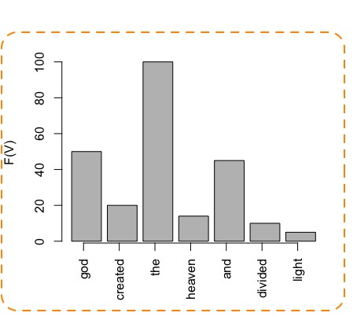
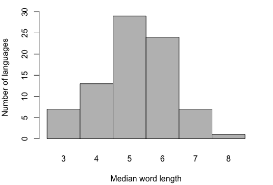
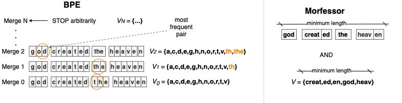
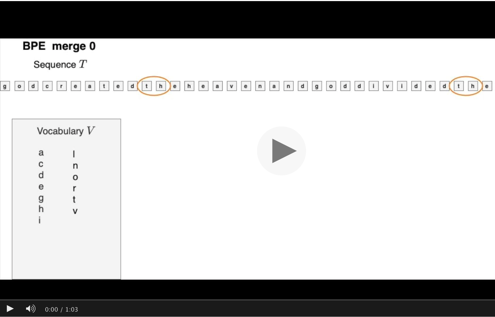

Tanja Samardžić, gostujuće predavanje, ETF, Beograd, 25. 05. 2021.

# (Mikro)tokenozacija teksta 

Tekst je jedna od tri glavne vrste podataka:

Izvor: [Khan Academuy](https://www.khanacademy.org/computing/computers-and-internet)

---
### 1. Problem segmentacije teksta 

U računarskoj obradi i analizi tekst se posmatra kao niska simbola _T_ gde svaki simbol pripada skupu _V_ koji zovemo vokabular ili alfabet bez obzira na to kako se elementi definišu. Ako uzmemo da se alfabet sastoji od reči, onda je tekst niska reči; ako su elementi slova, onda je tekst niska slova itd.  

**Važno:** alfabet ``!=`` skup slova!

Definisanje alfabeta se često uzima kao nešto trivijalno, nešto što se može zdravorazumski rešiti segmentacijom teksta na __tokene__, gde se pod pojmom _token_ podrazumeva svako pojavljivanje svakog simbola u datom teksu. Segmentacija teksta na tokene se naziva _tokenizacija_ i može se uporediti sa segmentacijom slike na piksele ili sa segmentacijom zvuka na kratke okvire (engl. _frames_). Tokeni, dakle, služe kao jedinice obrade teksta na sličan način kao pikseli u slučaju slike i kratki okviri u u obradi zvuka. Za razliku od slike i zvuka, segmentaciji teksta se obično pristupa sa manje opreza. Reči se obično smatraju tokenima, tj. jedinicama inicijalne obrade koje je lako identifikovati. To je, međutim, dosta problematična zabluda na koju lingvisti dosta bezuspešno upozoravaju već duže vreme. Ovaj klip na engleskom objašnjava ukratko u čemu je problem. 
 
 

 
 

Mi ćemo se ovde malo zadržati na jednom primeru na srpskom:  

> Kod računara se sve može posmatrati kao "rekla-kazala" dokaz. 

Od koliko reči se sastoji ova rečenica? 

| 1 | 2      | 3 | 4   | 5          | 6        | 7            | 8            | 9          | 10  | 11   | 12 | 13  | 14 | 
|:--|:-------|:--|:----|:-----------|:---------|:-------------|:-------------|:-----------|:----|:-----|:---|:----|:---|
|Kod|računara|se |sve  |može        |posmatrati|kao           |"rekla-kazala"|dokaz.      |     |      |    |     |    |
|Kod|računara|se |sve  |može        |posmatrati|kao           |"             |rekla-kazala|"    |dokaz |.   |     |    |
|Kod|računara|se |sve  |može        |posmatrati|kao           |"             |rekla       |-    |kazala|"   |dokaz|.   |
|Kod|računara|sve|može |posmatratise|kao       |"             |rekla|-|kazala|"           |dokaz|.     |    |     |    |
|Kod|računara|sve|može |posmatratise|kao       |"rekla-kazala"|dokaz.        |            |     |      |    |     |    |

Važne pouke:

- Svi odgovori su na neki način tačni
- Od toga kako definišemo alfabet zavisi
  - dužina teksta 
  - frekvencija tokena u tekstu 

---

### 2. Problem retkih reči i mikrotokenizacija

Verovatnoća da se neki simbol pojavi u tekstu je, zapravo, srazmerna dužini simbola, koju obično izražavamo brojem slova. U našem (konstruisanom) primeru simbol `the` je najkraći i njegova verovatnoća je najveća. S druge strane, imamo, na primer, simbol `heaven` koji je znatno duži i ređi (manja verovatnoća). 

Ako tekst posmatramo kao kôd u smislu __teorije informacija__, onda odnos između dužine simbola i njegove verovatnoće proističe iz komunikativne efikasnosti jezika. Ovaj odnos je pokazao __Zipf__ još davne 1949![1] Da pojednostavimo, zbog komunikativne efikasnosti jezika, kratke reči ćemo viđati često u bilo kom tekstu i moći ćemo da procenimo njihovu verovatnoću, dok će duge reči biti retke. Retko pojavljivanje reči predstavlja problem za obradu jezika ne samo zato što je teško proceniti njihovu verovatnoću, već i zato što su izvor nepoznatih simbola za trenirane modele. Koliko god da je veliki set podataka za treniranje modela, uvek će veliki broj reči ostati van njega i time biti nepoznat modelu. 

Koja dužina reči je najuobičajenija u jezicima?  

A u srpskom?

Generalno, jezici koji imaju razvijenu morfologiju imaju duže reči

---

### 3. Algoritmi za mikrotokenizaciju

### 4. Mikrotokenizacija u diskretnoj i kontinualnoj reprezentacija teksta

### 5. Dužina mikrotokena

\[1\]: George Kingsley Zipf (1949), Human behavior and the principle of least effort, Addison-Wesley Press

