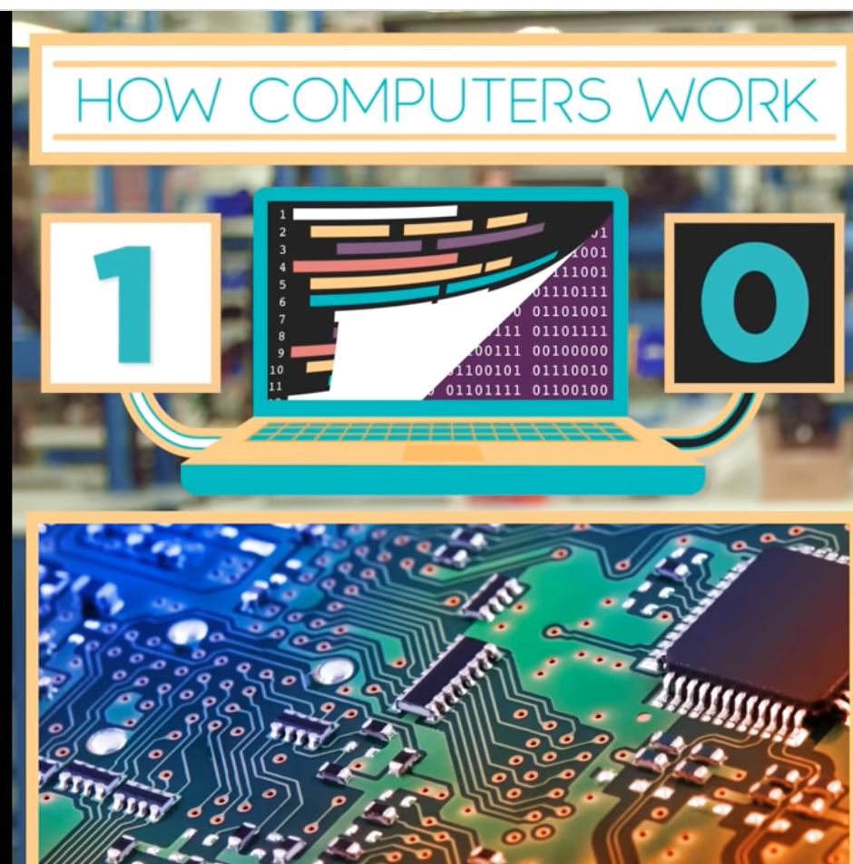
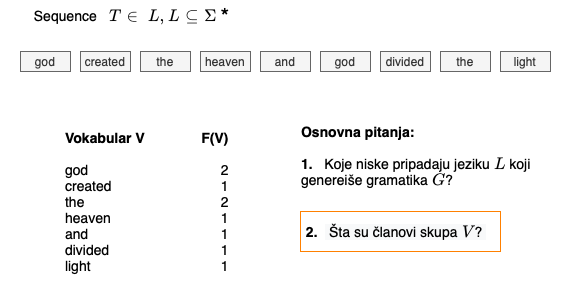
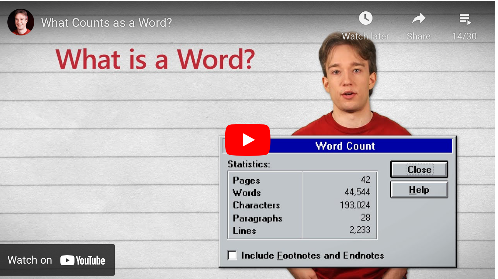
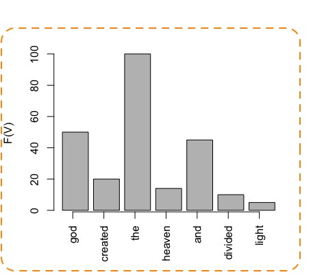
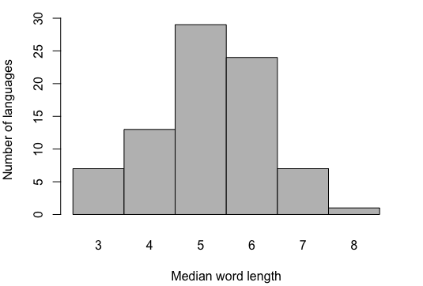
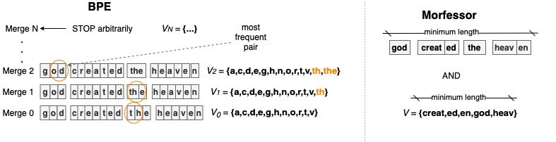
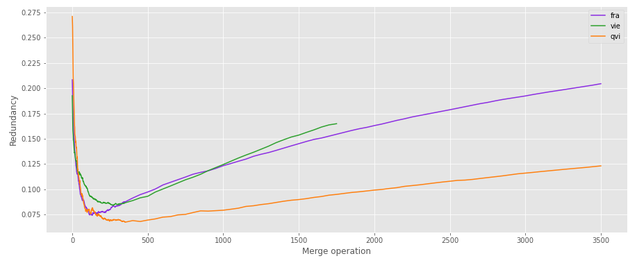
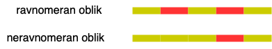

Tanja Samardžić, gostujuće predavanje na kursu (Obrada prirodnih jezika)[https://rti.etf.bg.ac.rs/rti/ms1opj/#obaveštenja], ETF, Beograd, 12. 04. 2023.

# (Mikro)tokenozacija teksta 

Tekst je jedna od tri glavne vrste podataka:

Izvor: [Khan Academy](https://www.khanacademy.org/computing/computers-and-internet)

---
### 1. Problem segmentacije teksta 

U računarskoj obradi i analizi tekst se posmatra kao **niska simbola** *T* gde svaki simbol pripada skupu *V* koji zovemo vokabular ili alfabet bez obzira na to kako se elementi definišu. Ako uzmemo da se alfabet sastoji od reči, onda je tekst niska reči; ako su elementi karakteri, onda je tekst niska karaktera itd.  

**Važno:** alfabet ``!=`` skup slova!

Segmentacija teksta se naziva **tokenizacija** i može se uporediti sa segmentacijom slike na piksele ili sa segmentacijom zvuka na kratke okvire (engl. *frames*). Niska simbola je, dakle, niska **tokena**, koji su jedinice obrade teksta na sličan način kao pikseli u obradi slike i kratki okviri u obradi zvuka. Svako ograničeno polje u ilustraciji gore je po jedan token, sadržaj polja je simbol ili član skupa *V* ili element alfabeta (ova tri izraza su sinonimi).  

Za razliku od slike i zvuka, segmentaciji teksta se obično pristupa sa manje opreza. Definisanje alfabeta se često uzima kao nešto trivijalno; podrazumeva se da je alfabet skup **reči** i da se tekst jednostavno deli na reči. Podrazumevanje da su reči jasno razgraničeni tokeni je dosta problematična zabluda na koju lingvisti poprilično bezuspešno upozoravaju već duže vreme. Ovaj klip na engleskom objašnjava u čemu je problem. 
 
 

 
 

U najkraćem, gotovo je nemoguće precizno definisati reč. Ako uzmemo da je reč svaka niska karaktera između dva razmaka, to znači da su `reč,` i `reč` dve različite reči. Ako odvojimo interpunkciju razmakom, onda svaki znak interpunkcije postaje reč. To onda vodi ka pitanju koje znakove odvajamo koje ne. Uglavnom, svaka formalna definicija u nekom trenutku pada u vodu i ostajemo sa proizvoljnim odlukama. Drugi problem je što unutar reči imamo strukturne elemente, što znači da to i nisu osnovne jedinice obrade, posebno u jezicima kao što je srpski. Ovde ćemo se malo zadržati upravo na jednom primeru iz srpskog:  

 

> Kod računara se sve može posmatrati kao "rekla-kazala" dokaz. 

 

Od koliko reči se sastoji ova rečenica? 

| 1 | 2      | 3 | 4   | 5          | 6        | 7            | 8            | 9          | 10  | 11   | 12 | 13  | 14 | 
|:--|:-------|:--|:----|:-----------|:---------|:-------------|:-------------|:-----------|:----|:-----|:---|:----|:---|
|Kod|računara|se |sve  |može        |posmatrati|kao           |"rekla-kazala"|dokaz.      |     |      |    |     |    |
|Kod|računara|se |sve  |može        |posmatrati|kao           |"             |rekla-kazala|"    |dokaz |.   |     |    |
|Kod|računara|se |sve  |može        |posmatrati|kao           |"             |rekla       |-    |kazala|"   |dokaz|.   |
|Kod|računara|sve|može |posmatratise|kao       |"             |rekla|-|kazala|"           |dokaz|.     |    |     |    |
|Kod|računara|sve|može |posmatratise|kao       |"rekla-kazala"|dokaz.        |            |     |      |    |     |    |

Važne pouke:

- Svi odgovori su na neki način tačni
- Od toga kako definišemo alfabet zavisi
  - dužina teksta 
  - frekvencija tokena u tekstu 

---

### 2. Problem retkih reči i morfološka struktura

Frekvencija pojavljivanja nekog simbola u tekstu je, zapravo, srazmerna dužini tog simbola, koju obično izražavamo brojem karaktera. U našem (konstruisanom) primeru u grafikonu gore simbol `the` je najkraći i njegova verovatnoća je najveća. S druge strane, imamo, na primer, simbol `heaven` koji je znatno duži i ređi (manja verovatnoća). 

Ako tekst posmatramo kao kôd u smislu **teorije informacija**, onda odnos između dužine simbola i njegove verovatnoće proističe iz **komunikativne efikasnosti jezika**. Ovaj odnos je pokazao **Zipf** još davne 1949![1] Da pojednostavimo, zbog komunikativne efikasnosti jezika, kratke reči ćemo viđati često u bilo kom tekstu i moći ćemo da procenimo njihovu verovatnoću, dok će duge reči biti retke. **Retko pojavljivanje reči** predstavlja problem za obradu jezika ne samo zato što je teško proceniti njihovu verovatnoću, već i zato što su izvor nepoznatih simbola za trenirane modele. Koliko god da je veliki set podataka za treniranje modela, uvek će veliki broj reči ostati van njega i time biti nepoznat modelu. 

Problem retkih reči je dodatno pojačan time što je razlika u frekvenciji reči uopšte ogromna: samo nekoliko najfrekventnijih elemenata skupa *V* zauzima veliki deo (i do polovine) teksta, dok otprilike polovina skupa *V* ima frekvenciju 1. Ovaj odnos između frekvencijskog ranga i broja simbola koji se nalaze u njemu je poznat kao **Zipfov zakon** (formlisan još 1935!). Njegovo poreklo nije još sasvim ispitano, ali verovatno ima veze sa raznim drugim prirodnim i družtvenim distribucijama. Drugim rečima, učestalost simbola u jeziku verovatno proističe iz učestalosti događaja u realnosti izvan jezika.  

Da se vratimo na problem tokenizacije, lingvisti su uočili da dužina reči ne potiče samo od komunikativne efikasnosti, već zavisi i od strukturnog tipa jezika: jezici koji imaju razvijenu **morfologiju** u principu imaju duže reči. Tu je interesantno pogledati distribuciju medijalne dužine reči u različitim jezicima, koji je raspon vrednosti i oblik distribucije. Sledeći grafikon prikazuje procenu dužine reči u 81 jeziku na tekstu Wikipedie. 

Šta mislite, koja je medijalna dužina reči u srpskom?

---

### 3. Algoritmi za mikrotokenizaciju

Kao logično rešenje za problem retkih reči nameće se redefinisanje skupa *V* time što se uobičajene reči rastave na manje segmente, koji zatim postaju članovi skupa *V*. Pošto se na taj način tokeni definišu kao relativno kratki simboli, ovu segmentaciju zovemo **mikrotokenizacija** (engl. subword tokenization). Prelazak na manje tokene otvara ogromno polje mogućih tokenizacija, jer, u principu, bilo koja podniska reči može da bude mikrotoken. Tu u igru ulazi i morfologija: duge reči se često sastoje od regularnih podniski od kojih su neke široko produktivne. Primer imamo već u našem opisu teksta kao niske simbola na početku: podniska `ed` se pojavljuje u dve reči i uopšte je nešto što može da bude sastavni deo skoro bilo kog glagola u engleskom. To je, dakle, sjajan kandidat za novog člana skupa *V*. Svi savremeni modeli za obradu jezika funkcionišu sa mikrotokenima, ali je njihova identifikacija i dalje predmet istraživanja. 

Problem rastavljanja reči na manje segmente se već dugo istražuje u obradi jezika, ali više kao izuzetno izazovan teorijski problem, nego iz praktičnih razloga. Tu glavnu reč vode istraživači iz Finske, pošto finski ima izuzetno razvijenu morfologiju koja predstavlja problem za obradu jezika. Oni su prvi razvili sistem za raščlanjivanje reči koji je ušao u široku upotrebu: [Morfessor](https://morfessor.readthedocs.io/en/latest/). Osim toga, oni već tradicionalno organizuju međunarodno takmičenje iz raščlanjivanja reči pod imenom [Morpho Challenge](http://morpho.aalto.fi/events/morphochallenge/).  

Raščlanjivanje reči na manje segmente je tek 2016. dobilo praktičnu primenu u obradi jezika i to kao priprema teksta (engl. pre-processing) za neuronske mreže. Tek od tada govorimo o mikrotokenizaciji. Za uvođenje mikrotokenizacije u obradu jezika najviše su zaslužni Rico Sennrich i njegove kolege, koji su došli do mnogo jednostavnijeg rešenja: [Byte Pair Encoding (BPE)](https://github.com/rsennrich/subword-nmt) ili kodiranje putem parova bajtova. BPE je generalna tehnika za kompresiju podataka koja, kad se primeni na tekst, daje slične rezultate kao morfološka analiza. Ova tehnika je brzo stekla ogromnu popularnost u treniranju neuralnih jezičkih modela za mašinsko prevođenje i uopšte. Ubrzo su se razvile i druge tehnike od kojih neke koriste slične principe kao Morfessor. Još dva algoritma su vrlo popularna: [Unigram](https://arxiv.org/pdf/1804.10959.pdf) (sličan pristup kao Morfessor) i [WordPiece](https://static.googleusercontent.com/media/research.google.com/ja//pubs/archive/37842.pdf) (sličan pristup kao BPE). 

Mi ćemo ovde kratko objasniti kako rade Morfessor i BPE, kao predstavnici dva glavna pristupa rešavanju problema mikrotokenizacije, lokalnog i globalnog.    

 

 
 
.....................................................................................................................................................................................................................
 
 

 
 

**BPE** je ekstremno jednostavan algoritam koji kompresuje podatke služeći se uočenim ponavljanjima. Kroz tekst prolazi u brojnim iteracijama -- i do nekoliko hiljada (u zavisnosti od konfiguracije) -- uzimajući segmentaciju na karaktere kao polaznu tačku. Dakle, u polaznoj tokenizaciji skup *V* je skup svih karaktera, konkretno UNICODE karaktera od kojih je većina kodirana jednim bajtom (otud ideja za primenu BPE). U svakoj iteraciji pronalazimo jedan par susednih karaktera sa najvećim brojem pojavljivanja u datom tekstu i taj par zamenimo novim simbolom koji dodamo u skup *V*. U narednoj iteraciji koristimo novi simbol i ponovo tražimo najčešći par i tako sve dok ne dostignemo zadati broj iteracija ili simbola. U primeru gore vidimo da je najčešći par u prvoj iteraciji `t h`. Kada izbrišemo razmak izmađu ova dva karaktera, dobijamo `th`, što je, zapravo novi simbol. 

Kad prestajemo da spajamo karaktere? To je još uvek poprilično otvoreno pitanje. Jedan tim istraživača, na primer, ustanovio je da je najbolje stati kad skup *V* dostigne veličinu *0.4 x |W|*, gde je *W* skup svih reči koje su se pojavile u tekstu. Videćemo malo kasnije još neke predloge. 

**Morfessor** je dosta složeniji algoritam koji potiče iz vremena statističkih, tj. probabilističkih modela. Sasvim suprotno od pristupa BPE, polazna tačka za Morfessor su sva moguća raščlanjivanja svake reči, dakle ogroman skup potencijalnih mikrotokena i njihovih kombinacija. U teoriji, verovatnoća celog ulaznog teksta se procenjuje u svim mogućim verzijama i odabira se najbolja verzija (ona koja daje najveću verovatnoću celog teksta). Jasno je, naravno, da je prolaz kroz sve moguće verzije nemoguć, tako da algoritam mora da suzi polje mogućnosti u startu i razmotri samo neke od verzija. To se postiže dodavanjem konkretnih ograničenja (npr. parcijalni skup *V*).  Konfiguracija Morfessora omogućava takođe da se kontroliše nivo raščlanjivanja, tj. da li dobijamo kraće ili duže mikrotokene.   

Ono što je zajedničko za sve algoritme je odnos između:

- dužine teksta
- dužine simbola 
- veličine skupa *V*. 

Što je skup *V* veći, to su simboli duži, to je tekst kraći. Cilj je, dakle, naći optimalne mikrotokene koji minimizuju sve tri vrednosti. U pristupu kakav koristi Morfessor, ovo i jeste eksplicitan cilj (jedino tako se postiže visoka verovatnoća celog teksta), dok se BPE može navesti ka tom cilju ali indirektnim ili dodatnim postupcima.   

---

### 4. Mikrotokenizacija u diskretnoj i vektorskoj reprezentacija teksta

Pomenuli smo gore da je mikrotekenizacija postala sastavni deo obrade jezika tek otkad se prešlo na rad sa neuronskim mrežama. Bilo je pokušaja i ranije da se regularnosti unutar reči iskoriste za skraćivanje tokena, ali su rezultati često bili iznenađujuće slabi. Vilar i njegov tim 2007 postavljaju pitanje [prevođenja na nivou karaktera](https://www.aclweb.org/anthology/W07-0705/). Ispostavlja se da je segmentacija na karaktere donekle korisna za vrlo bliske jezike. Zapravo, individualni karakteri su, ipak, prekratki, tako da se kao jedinice uzimaju podniske od dva karaktera (engl. character bigrams). 

U radu iz 2009, [de Gispert i tim](https://www.aclweb.org/anthology/N09-2019/) uspevaju da poboljšaju statističko mašinsko prevođenje mikrotokenizacijom, ali i ovde su se prvobitna očekivanja ispostavila kao naivna. Naime, za uspeh je bilo potrebno uzeti u obzir više mogućih analiza iste reči, pa odabrati u toku dekodiranja jednu od njih. Inače, ako se segmentacija reči uzme kao data, to umanjuje konačni skor. 

Konačno, sa prelaskom na vektorsku (kontinualnu) reprezentaciju teksta, negde od 2013., mikrotokenizacija je počela da daje dobre rezultate na svim nivoima i postala je neizostavni deo jezičke obrade. Nije i dalje sasvim ispitano zašto mikrotokenizacija ima više smisla u kontinualnoj reprezentaciji, ali se odgovor verovatno krije u činjenici da je tok informacija fluidniji u kontinualnoj reprezentaciji i da granice između tokena nisu toliko striktne kao u ranijim diskretnim modelima. 

Pitanje koji su stvarno elementi skupa *V* je, međutim, i dalje nerešeno. NLP inženjeri bi ga najradije rešili tako što bi ga izbegli. U nekom trenutku, Google je, na primer, izbacio model [CANINE](https://arxiv.org/abs/2103.06874) za koji su tvrdili da rešava pitanje tokenizacije tako što gradi celokupnu reprezentaciju teksta sam počevši od karaktera. Iako rezultati njihovih eksperimenata pokazuju poboljšanje u odnosu na druge metode, ovaj pristup nije ušao u širu upotrebu. 

---

### 5. Kako do optimalnih mikrotokena

Moj tim u Cirihu je istraživao šta se dešava sa entropijom i redundantnošću teksta u procesu mikrotokenizacije metodom BPE. Uočili smo jedan pomalo zbunjujući trend:

Kao što vidimo u ovom primeru na tri jezika (francuski, vijetnamski, kečua), redundantnost opada jako brzo u prvih 200-300 BPE iteracija, zatim dostiže minimum i onda kreće ponovo da raste (u većini jezika). Interesantno je da ovaj trend važi za gotovo sve jezike, bez obzira kakva je njihova morfologija. 

Proučavajući dalje šta se tu dešava, došli smo na ideju da dobijene tokene predstavimo geometrijski:

 
Crveni segmenti u ilustraciji predstavljaju simbole koji su nastali u procesu spajanja. Zanimalo nas je da vidimo da li su spojeni simboli manje-više ravnomerno raspoređeni po pozicijama u tekstu ili teže da se neravnomerno grupišu. Ispostavilo se da su vrlo ravnomerno raspoređeni, kao da se u tekstu ravnomerno smenjuju poznati (ponovljeni) i nepoznati (ređi) mikrotokeni.

Ideja za ovu analizu je potekla od još jednog poznatog zakona iz teorije informacija, [Menzerat-Altmanovog zakona](https://en.wikipedia.org/wiki/Menzerath%27s_law), koji je, za raazliku od Zipfovog zakona, ostao dosta nepoznat široj istraživačkoj zajednici iako datira još iz 1954. 

Suština ovog zakona je da se duže reči segmentiraju na kraće segmente ili, prema Menzeratovoj opštoj formulaciji, što je celina veća to su njeni delovi manji. Gerlah[2] je pokazao kako ovo pravilo funkcioniše u nemačkom:

|Rang dužine reči | Broj reči u rangu | Prosečna dužina segmenta |
|:-------------|:--------------|---------------------------|
|1 | 2391 | 4.53 |
|2 | 6343 | 3.25 |  
|3 | 4989 | 2.93 |  
|4 | 1159 | 2.78 |  
|5 | 112 | 2.65 |  
|6 | 13 | 2.58 |  

 

Pošto se ovde radi o prosečnoj dužini segmenta, ovaj rezultat može da se dobije i u slučaju ravnomernih i neravnomernih mikrotokena. Takođe, Gerlahova merenja se odnose na ručno raščlanjivanje reči, dok se naša merenja odnose na automatsko raščlanjivanje. 

Zato smo sproveli još jednu studiju poredeći nekoliko algoritama sa ručnom obradom. Ispostavilo se da ručna obrada daje ravnomerniji raspored od svih algoritama, osim jedne verzije BPE -- one koja koristi tačku minimalne redundantnosti.  

Ravnomernost je nešto što se može, u principu, integrisati u algoritme za mikrotokenizaciju, ali još uvek nije lako utvrditi kakav bi to uticaj imalo na rezultate modela.  

---
\[1\]: George Kingsley Zipf (1949), Human behavior and the principle of least effort, Addison-Wesley Press

\[2\]: Reiner Gerlach (1982), Zur Überprüfung des menz-erathschen gesetzes im bereich der morphologie.Glottometrika, 4(2):95–102.

